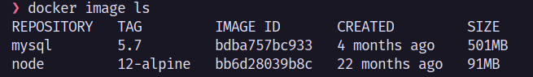
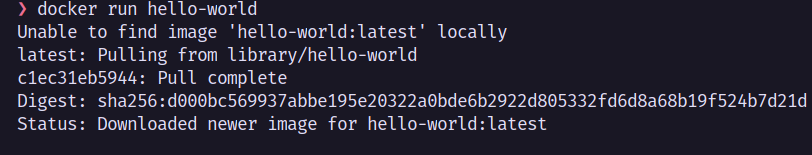
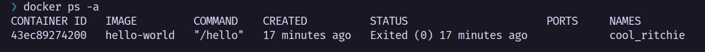
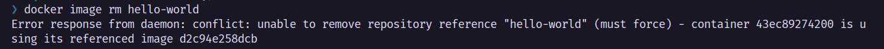
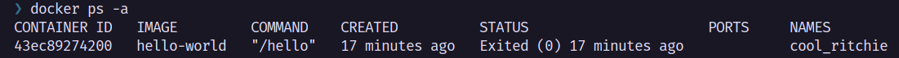
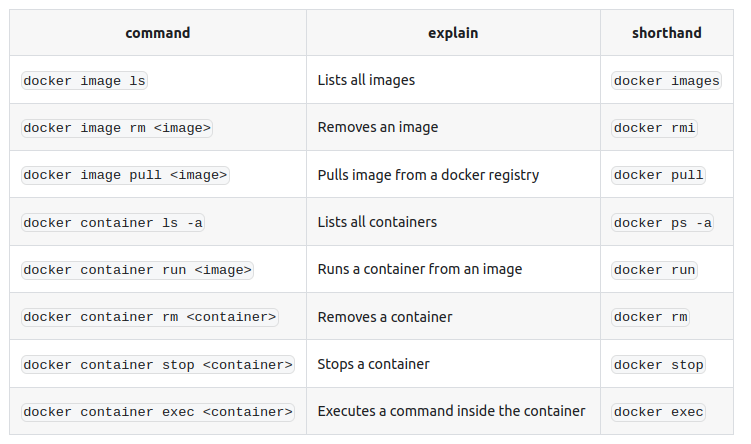

## Istilah dan Pengertian dalam docker

Docker is a set of platform as a service (PaaS) products that use OS-level virtualization to deliver software in packages called containers." - from Wikipedia.

intinya docker merupakan virtualisasi *OS-level yang digunakan untuk mengisolasi aplikasi.

dalam docker ada istilah yang sering ditampilkan yaitu : 
1. Container
2. Image
   
Container merupakan suatu paket dari suatu software dan ketergantungannya (_dependencies_). 

Image adalah suatu blueprint / template isinya sebuah perintah dan ketergantungan software didalamnya untuk dijalankan oleh kontainer.

Anggapannya adalah seperti container sebuah makanan instant yang tinggal dihangatkan, sedangkan kalau image adalah resep untuk membuat makanan instant tersebut, jadi image itu instruksi dan bahan bahanya untuk membuat container, nanti container tersebut tinggal dijalankan saja.

### Image 
sebuah image tidak bisa diubah setelah dibuat jadi jika ingin mengubahnya bisa dengan mengupdatenya kembali menggunakan _dockerfile_ dan dibuat menggunakan command `docker image build`

contoh sebuah _dockerfile_ :

```
FROM <image>:<tag>
RUN <install some dependencies>
CMD <command that is executed on `docker container run`>
```
 bisa dilihat setiap baris merupakan instruksi untuk membuat sebuah image.

 untuk melihat list semua image gunakan commad  : `docker image ls -a`



 jadi _dockerimage_ juga sebuah resep untuk membuat image, sedangkan image merupakan resep untuk membuat container.
 
### Container
Setiap Container beriskan aplikasi beserta kebutuhanya (_dependencies_), container bisa dihentikan, dimulai, dan dinteraksi.

 untuk menjalankan container bisa dilakukan dengan `docker run <your-image>`, jika image yang ditujukan tidak ada maka akan mengunduhnya terlebih dahulu

#### Menjalankan Container

 contohnya seperti `docker run hello-world`



jika terminal anda seperti freeze, * tidak bisa mengetik atau tidak berfungsi command setelah diinput
kemungkinan container tersebut sudah berjalan dengan baik.

untuk menghindari itu gunakan flag `-d` "detached mode" ini akan membuat docker tidak menggangu termina yang sedang anda gunakan.

untuk menghentikannya dalam situasi freeze, gunakan `CTRL + C`

#### Melihat Container
dan untuk melihat semua container bisa menggunakan `docker ps -a` atau `docker ps`
**-a** akan menampilakan semua proses yang aktif maupun tidak, jika tidak maka menampilkan proses aktif saja.

#### Menghentikan Container
untuk mengehentikan Container bisa menggunakan command `docker stop <your-container>`.

#### Interaksi Container
interaksi melalu kontainer bisa dilakuakan menggunakan `docker exec <cmd>` ini akan mengeksekusi perintah didalam container tersebut.

### Menghapus Image dan Container
Sebelum menghapus container / image pastikan container tersebut dinonaktifkan terlebih dahulu. 

ini jika ada error .
#### Menghapus Container
menghapus container dapat dilakukan dengan `docker container rm <your-container id atau nama>`	


contoh menghapus menggunakan ID : `docker container rm 43e` jika ada yang sama maka akan mensugesti nama yang sama seperti 43ec atau 43ed

contoh menghapus menggunakan nama : `docker container rm cool_ritchie`

menghapus container bisa dilakukan secara banyak dengan cara `docker container rm <container1> <container2>` *tanpa bracket ataupun coma

atau jika ingin dilakukan secara masal bisa dengan `docker container prune` ini juga bisa untuk menghapus image dengan 
`docker image prune`

#### Menghapus Image
Menghapus image dapat dilakukan dengan `docker image rm <your-image>` jika ada error pastikan untuk menghapus container yang berhubungan dengan image tersebut terlebih dahulu.

### Mengunduh image
untuk mengunduh image dari docker hub (semacam repository) bisa gunakan `docker pull <the-image>` ini akan mengunduh image tersebut tanpa menjalankannya.

### Perintah Docker Yang sering digunakan

source : [devopswithdocker](https://devopswithdocker.com/part-1/section-1/)