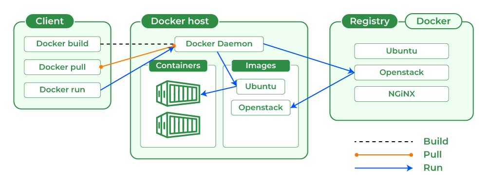
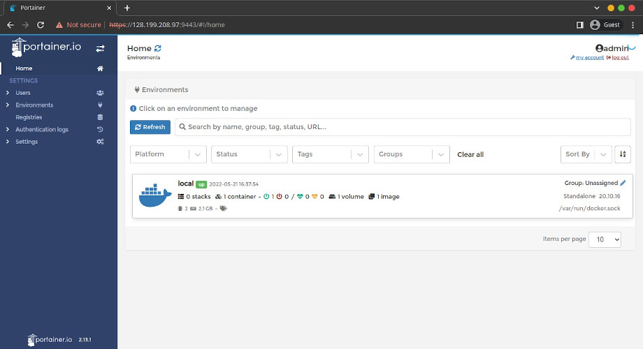
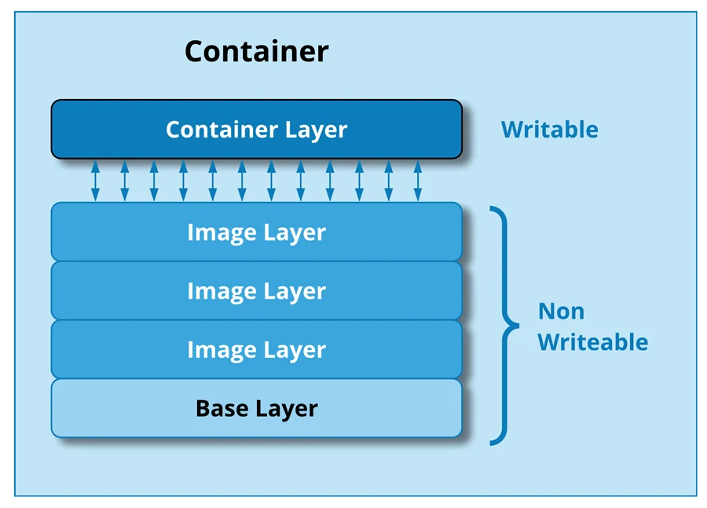
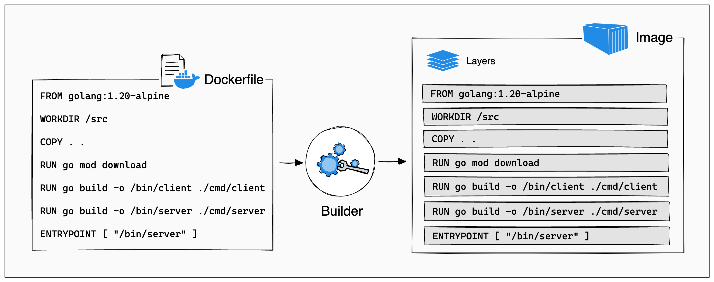

## Istilah dan Pengertian dalam docker

Docker is a set of platform as a service (PaaS) products that use OS-level virtualization to deliver software in packages called containers." - from Wikipedia.

intinya docker merupakan virtualisasi *OS-level yang digunakan untuk mengisolasi aplikasi.

dalam docker ada istilah yang sering ditampilkan yaitu : 
1. Container
2. Image
   
Container merupakan suatu paket dari suatu software dan ketergantungannya (_dependencies_). 

Image adalah suatu blueprint / template isinya sebuah perintah dan ketergantungan software didalamnya untuk dijalankan oleh kontainer.

Anggapannya adalah seperti container sebuah makanan instant yang tinggal dihangatkan, sedangkan kalau image adalah resep untuk membuat makanan instant tersebut, jadi image itu instruksi dan bahan bahanya untuk membuat container, nanti container tersebut tinggal dijalankan saja.

Seperti Zip itu adalah image sedangkan setelah anda extract isinya yaitu containernya.

"Build Once Run Anywhere".

### Keuntungan Menggunakan Docker
1. Portable
2. Lightweight
3. Greater Efficiency
4. Platform Independent
5. Secure
6. Cost Effective

### Docker Feature
1. Overlay File System : jadi bisa tracking setiap perubahan dari layer ( kayak git gitu konsepnya)
2. Namespaces :  to provide the isolated workspace called the container
3. Control Group : a feature of the Linux kernel that allow you to limit the access processes and containers have to system resources such as CPU, RAM, IOPS and network dan bisa juga beradaptasi sesuai kebutuhannya
   * jika VM setelah resource di alokasikan maka tidak bisa di bagikan lagi ( intinya diambil dan ndak dibagi lagi selain untuk VM)

### Docker Architecture
1. Client : merupakan interface untuk berinteraksi dengan docker Daemon
2. DOCKER_HOST : Merupakan Komputer yang menjalankan containernya
3. Registry : Merupakan Repository : Docker Hub
4. Docker Daemon : Merupakan Docker Engine yang memange docker image, container, network, dan volumes.



#### Extra
Portainer adalah management docker didalam docker, jadi kita dapat memanage dalam jarak jauh *deploy dan dll

### Image 
"_Image adalah suatu blueprint / template isinya sebuah perintah dan ketergantungan software didalamnya untuk dijalankan oleh
kontainer_."

sebuah image tidak bisa diubah setelah dibuat jadi jika ingin mengubahnya bisa dengan mengupdatenya kembali menggunakan _dockerfile_ dan dibuat menggunakan command `docker image build`

contoh sebuah _dockerfile_ :
```
FROM <image>:<tag>
RUN <install some dependencies>
CMD <command that is executed on `docker container run`>
```
 bisa dilihat setiap baris merupakan instruksi untuk membuat sebuah image.

 untuk melihat list semua image gunakan commad  : `docker image ls -a`


 jadi _dockerimage_ juga sebuah resep untuk membuat image, sedangkan image merupakan resep untuk membuat container.

 Kadang dalam image, menggunakan alpine linux sebagai base OSnya karena sangat ringan.

#### Snapshot
_A docker that **allows you to create snapshots (copies) of the current document, and to return to these states** afterwards._

Important note: _Always treat your **docker** images/containers as something you can blow off easily and recreate from scratch_

#### Templates

#### Extra
BusyBox merupakaan kumpulan unix ultilities as single executable : [Busybox Introduction](https://www.google.com/url?sa=t&rct=j&q=&esrc=s&source=web&cd=&cad=rja&uact=8&ved=2ahUKEwjGy722odyEAxWP4zgGHbKiDawQFnoECBsQAw&url=https%3A%2F%2Fsiddhivinayak-sk.medium.com%2Fbusybox-the-developers-swiss-army-knife-for-embedded-linux-98c312ac5843&usg=AOvVaw0AK21nZkiaHm7gmdamgHKO&opi=89978449)

_BusyBox **provides independent, or extra, tools to those installed on the system**. For example, BusyBox's ash may be used in place of the system ash shell, or even be used if no other ash is installed._

isinya ada webserver, diagnosa jaringan, dll. cocok untuk dalam keadaan tertentu seperti test

docker repo :[BusyBox Docker](https://hub.docker.com/_/busybox)
make docker images form running container : [link](https://www.howtogeek.com/devops/how-to-create-a-docker-image-from-a-running-container/)

### Container
Setiap Container beriskan aplikasi beserta kebutuhanya (_dependencies_), container bisa dihentikan, dimulai, dan dinteraksi.

 untuk menjalankan container bisa dilakukan dengan `docker run <your-image>`, jika image yang ditujukan tidak ada maka akan mengunduhnya terlebih dahulu

#### [Container Layers](https://docs.docker.com/build/guide/layers/)	

https://stackoverflow.com/questions/31222377/what-are-docker-image-layers
	
_The order of Dockerfile instructions matters. A Docker build consists of a series of ordered build instructions. Each instruction in a Dockerfile roughly translates to an image layer._


tambahan note :  [Cached layers](https://docs.docker.com/build/guide/layers/#cached-layers)

#### Menjalankan Container

 contohnya seperti `docker run hello-world`


jika terminal anda seperti freeze, * tidak bisa mengetik atau tidak berfungsi command setelah diinput
kemungkinan container tersebut sudah berjalan dengan baik.

untuk menghindari itu gunakan flag `-d` "detached mode" ini akan membuat docker tidak menggangu termina yang sedang anda gunakan.

untuk menghentikannya dalam situasi freeze, gunakan `CTRL + C`

#### Melihat Container
dan untuk melihat semua container bisa menggunakan `docker ps -a` atau `docker ps`
**-a** akan menampilakan semua proses yang aktif maupun tidak, jika tidak maka menampilkan proses aktif saja.

#### Menghentikan Container
untuk mengehentikan Container bisa menggunakan command `docker stop <your-container>`.

#### Interaksi Container
interaksi melalu kontainer bisa dilakuakan menggunakan `docker exec <cmd>` ini akan mengeksekusi perintah didalam container tersebut.

### Menghapus Image dan Container
Sebelum menghapus container / image pastikan container tersebut dinonaktifkan terlebih dahulu. 

ini jika ada error .
#### Menghapus Container
menghapus container dapat dilakukan dengan `docker container rm <your-container id atau nama>`	


contoh menghapus menggunakan ID : `docker container rm 43e` jika ada yang sama maka akan mensugesti nama yang sama seperti 43ec atau 43ed

contoh menghapus menggunakan nama : `docker container rm cool_ritchie`

menghapus container bisa dilakukan secara banyak dengan cara `docker container rm <container1> <container2>` *tanpa bracket ataupun coma

atau jika ingin dilakukan secara masal bisa dengan `docker container prune` ini juga bisa untuk menghapus image dengan 
`docker image prune`

#### Menghapus Image
Menghapus image dapat dilakukan dengan `docker image rm <your-image>` jika ada error pastikan untuk menghapus container yang berhubungan dengan image tersebut terlebih dahulu.

### Mengunduh image
untuk mengunduh image dari docker hub (semacam repository) bisa gunakan `docker pull <the-image>` ini akan mengunduh image tersebut tanpa menjalankannya.

### Perintah Docker Yang sering digunakan

source : [devopswithdocker](https://devopswithdocker.com/part-1/section-1/)